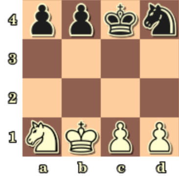

# octad4j
Octad4j is the standard library for the Octad chess variant written in Java

# Board Layout

Each player begins with four pieces, a knight, their king, and two pawns placed in that order. An example of this can be seen in the board diagram below:

